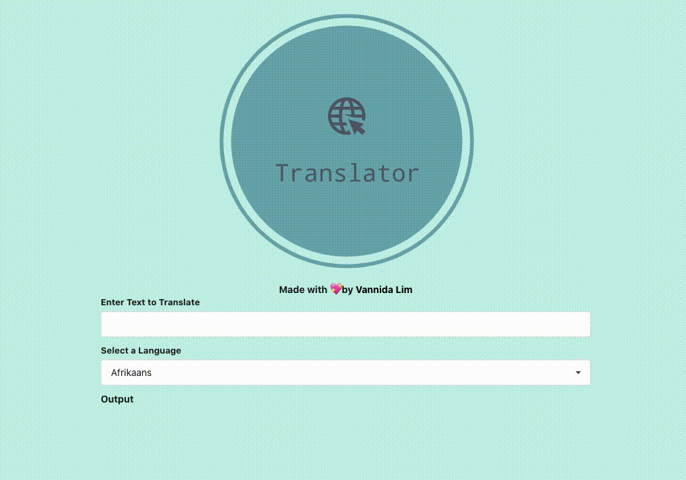

<h1 align="center">Translator 🌐</h1>

A <code>React</code> frontend web application. 

Built with 💖 && ✨ by <a href='https://github.com/vannida-lim'>Vannida Lim</a>

**Demo**
------------

**Tech Stack**
--------------

This web app makes use of the following:

-   React
-   Google Translate API Key 

**Installing**
--------------
-   Clone this repo to your local machine `git clone git <this-repo-url>`

-   `cd`  to `translator-app`

-   run  `npm i && npm start` to run dependencies and start server locally
